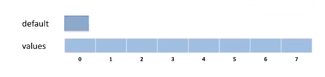
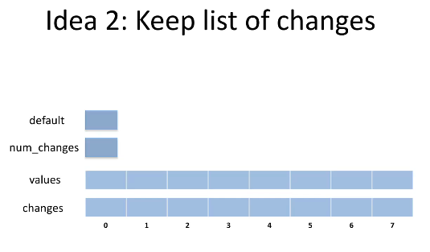
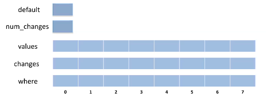
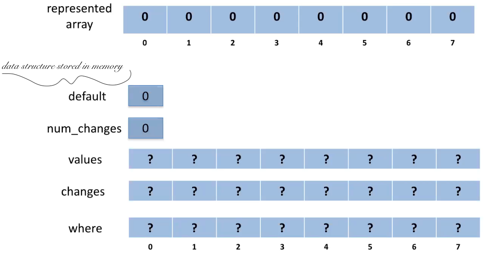
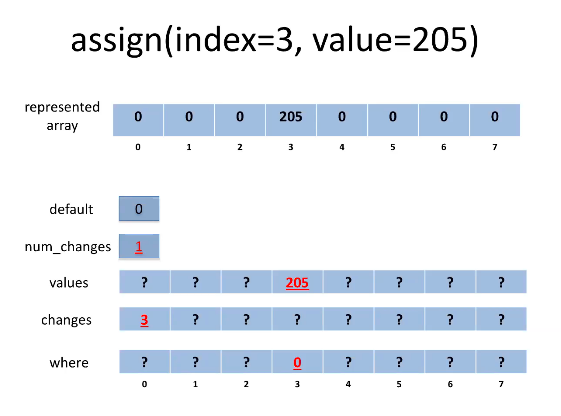
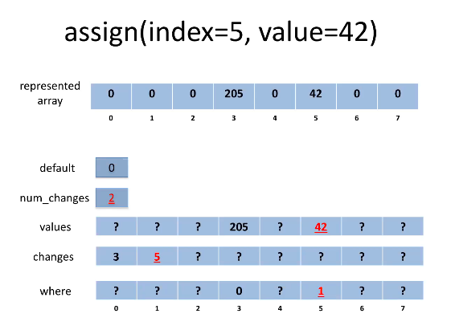
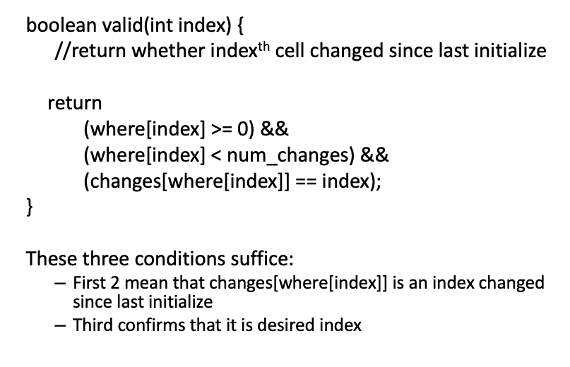

### short notes 14 September 2020
#### _C# v Java and ADTs_
   
##### recall: abstract data types
- ex from 142: list   
	- _look at list adt_   
	- remember, different implementations for adt, doubly linked list, array, etc.   
   
##### _concept check: array vs. linked_
Of the following, which is faster in an array?   
1. addFront   
2. add   
3. get   
4. removeLast   
   
Answer: get   
_you don't have to traverse_
   
##### Array ADT
You need:   
- constructor   
- way to read ith cell   
	- T access(int index)   
- way to set ith cell   
	- void assign( int index, T val)   
- way to set all cells to val   
	- void initialize(T val)   
   
You don't directly have this in java.   

##### standard implementation
In C   
- contiguous memory - address arithmetic to access cells   
- you can get to the 1st cell as you know what address... Then you can calc any following address   
- use loop to initialize   
   
In Java   
- constructor includes initialization   
- adds bounds checking   
	- every array implicitly has a size... So there has to be a bounds check before certain methods (like add)   
	- this means that its a little slower than C, but still constant   
- same overall, except now it's a reference not an address (_what?_)   
   
Implementing in Java is the same as C, except there's an extra size attribute and the details are hidden (not an address or pointer). It's slower because of bounds checking, and the instructor initializes.   
Both are:   
- constant for assign   
- linear for initialize   
...   
- C - constant for construction   
- java - linear for construction because it includes initialization   
   
_BUT... we want constant time for all four: create, access, assign, and initialize_   
To achieve that, we must use extra space ^~^   
   
---
   
#### Solution
##### idea 1 - default value
Implementation with C array as basis.
 The main part of the array is `values`, which stores the value of the cell.
 Then there will be a default value so that cells not changed since initialization will have their value stored in `default`.   
   
- Once init.  ->  just change val from `defualt`   
- Then, when you go to access the cell, the program checks if it's been changed since last init.   
- if so, go find val   
- if not, use default val   
   
  
    
_access operation is now more complicated, but still in initial time_   
_init is quick, and access is quick_   
   
This doesn't immediately lend itself to implementation, so...   
   
##### idea 2 - keep list of changes
Keep a list of the changes so that idea 1 will work.   
   
__Anatomy:__
Default -> stores the last thing I initialize   
Values -> if I change something in the array, it's reflected here   
  
Then, you just need to decide if this index had been changed since last init.   
    
TODO:   
- store indices of changes in `changes`   
- keep track of number of changes in `num_changes`   
THUS:    
- `changes` and `num_changes` together are an array-list of indices for indices that have been changed     
    
   
    
_initialize is constant time_
_linear time for access, linear time for assign... that's no bueno, we want constant not linear_    
    
##### idea 3: store index locations
Solve: how to determine with an index if it has changes.     
    
__Add 3rd array to Anat. called Where__     
- Tells where in `cahnges` to look -- avoiding linear time as we don't need to go all through   
- allows us to quickly implement access and assign, because we can determine in constant time if changes have been made.   
    
    
    
##### full solution
    
(_however, in reality every space is in use_)
    
_code:_   
```java
void initialize(value v) {
    default = v;
    num_changes = 0;
}
```
    
##### solution in action    
  
    
  
    
_code for reference, @davidBunde_   
```java
void assign(int index, value v) { //set indexth cell to v
    values[index] = v;
    if(!valid(index)) {
        where[index] = num_changes; //set hint
        changes[num_changes] = index; //add index to list
        num_changes++;
    }
}
valid(index): whether indexth cell updated since initialize
```
   
    
     
