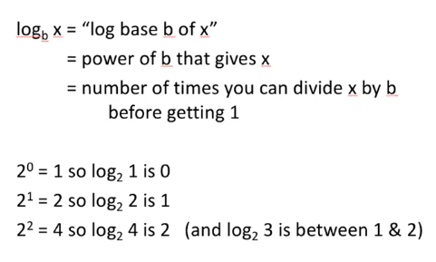
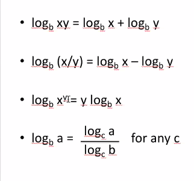
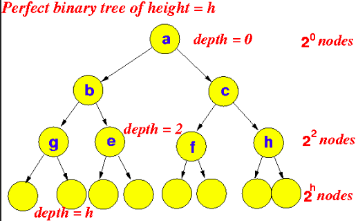

#### short notes 16 September 2020
##### _review and induction_    
    
##### review: last class, questions
`num_changes` and `changes` together are an array list together of
 the number of changes and the position.    
    
`values` stores the values that have been changed   
    
##### where would you implement this?
This is only worthwhile in a situation
 where you're initialize (or mass initialize) a lot.
 Perhaps a hashing situation?   
    
For example, we're using it to track hand raising:  
- five people raise their hands     
- fill the array will individuals   
- pick one  
- then initial entire array to 0    
    
##### math review
__Logarithms__      
   
    
    
__Induction Framework__     
- base case -- claim is true for one or more small vals     
- induction hypothesis (IHOP) -- assume claim is true up to point    
- induction -- show that claim hold true for next val   
    
__Example__     
Proof that 1+2+3+...+n=n(n+1)/2     
    
IHOP                BASE CASE: (n=1):    1=     1(1+1)/2 = 1      
Induct. Step (IS)   Consider:   1+2+3+...+N+(N+1) =     n(n+1)/2 + (n+1) by induction hypothesis (IHOP)     
                    = (n+1) (n/2 +1)       _factor out_
                    = (n+1)(n+2)/2      
    
---
    
##### BST
__Full Binary Tree__    
- every interior node has 2 children    
- all leaves are on the same level      
    
__BST Height of 3__    
  
    
_The above binary search tree has a hight of 3,
 counting the child nodes.
 The tree is balanced as all leaves are on the same level._     
    
_Thus, we have the equation 2^3 + 2^2 + 2^1 + 2+0 to
 return the tota l number of nodes.
    
2^3 = 8     
2^2 = 4     
2^1 = 2     
2^0 = 1     
    = 15    
Thus, we have a total of 15 nodes._     
    
##### prove using induction: a full bst of height h has 2^(h+1)-1 nodes
BASE: h=1       2^(0+1)-1=1     
IHOP: Assume a full bst of height h has a 2^(h+1)-1 nodes   
IS: you have the root, then 2 sub trees height h, full height h+1. They
 have to be height h in order to be a full bst.      
1+(2^(h+1)-1) + (2^(h+1)-1) = 2*2^(h+1) -1      
    = 2^(h+2) -1    
    

