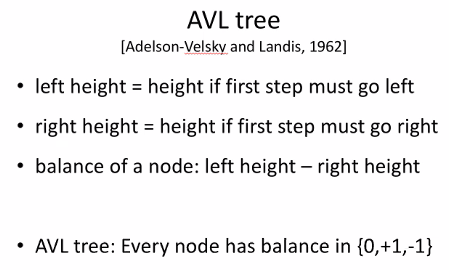

### short notes 17 September 2020
#### _induction, omega, and avl trees_   

    
#### recall: full binary tree
   
    
   
    
Omega is greater than or equal (like Big O, if
 you're saying something's at most use Big O
 and if you're saying something's at least use
 Omega.    
    
[] _WHAT?  -->  see tutors for this concept._      
[] _I don't understand induction hypothesis._      
    
#### induction: binary tree w/ n(>=1) nodes has n-1 edges
   
BASE: 0     1 node, 0 edges    
IHOP: Assume binary tree w/ k nodes has k-1 edges for k<=n      
IS: consider binary tree T w/ n+1 nodes. Let x be root of T & Tl, Tr be its left and right sub trees.    
Let Nl and Nr be the sizes of Tl and Tr.    
CASE 1: ..... _COMPLETE LATER_      
    
[] _Why strong induction?_
 
    
    
#### height of an arbitrary node
- height of a node is the height of the
 subtree rooted at that node.   
- In other words, the height or a node is the longest
 path off of that node.
    
#### AVL Tree
   
    
   
   
    
[ ] _Understand how to create avl trees of_
 _height h. What's the connection to fibinachii?_   
    
    
---
### REVIEW
- induction     
- omega concept above   
- [Showing binary search correct w/ induction](https://www.cs.cornell.edu/courses/cs211/2006sp/Lectures/L06-Induction/binary_search.html)   
- [induction examples](https://www.cs.cornell.edu/courses/cs312/2002sp/handouts/induction/induct-examples.html)   
- [more induction](https://www.cs.odu.edu/~cs381/cs381content/induction/induction.html)   

