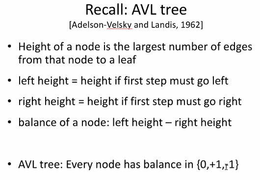
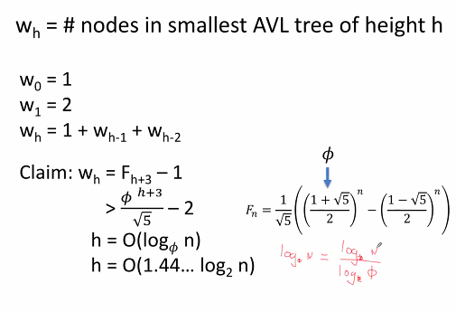
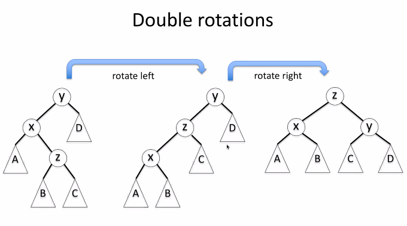
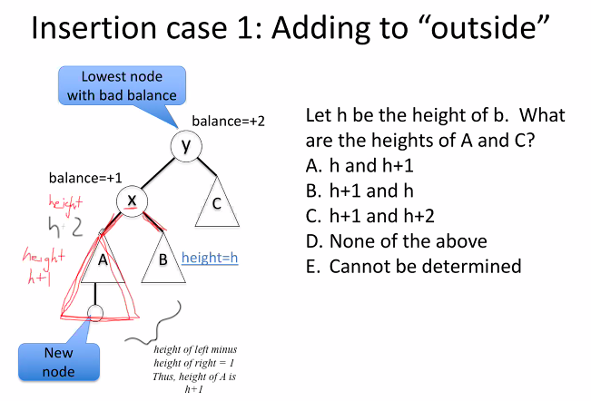
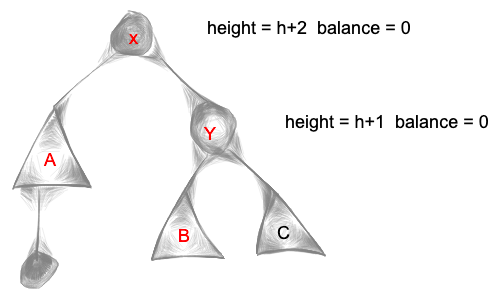

### short notes 18 September 2020
#### _AVL Trees_
    
#### recall
    
    
#### I Don't Understand
    
   
#### rotations (adding to avl trees)
   
    
#### height
  
    
How do we get height of x here?     
   
#### balance
     
    
 
