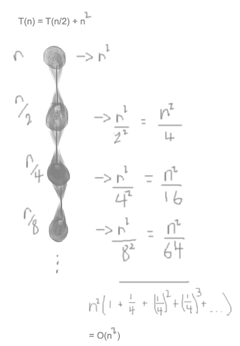

### short notes 21 September 2020
#### _AVL other case_   
    
#### recall: fixing avl tree
- find lowest node out of balance   
    - if none, tree's balanced      
- if balance = 2, check left neighbor   
    - if balance of neighbor = 1, single right rotation   
    - else double rotation (left then right)    
- else check right neighbor     
    - if balance of neighbor = -1, single left rotation     
    - else double rotation (right then left)        
    
#### balance and height
    
    
[ ] _review this_       
    
#### divide and conquer
- problem too hard?     
    - split into pieces     
    - solve recursively     
    - combine results    
- examples      
    - mergesort    
    - quicksort     
    - binary search     
    
__finding running time:__       
     
    
(merge is linear, O(n))     
    
however, when solving recurrances we
 aren't worried about constants.
 We're just looking for an order notation.
 Thus, you can put n or 1 -- it doesn't
 matter because the constant will be
 multipled out against the answer of the
 recurrance.    
      
    
__caveat:__     
imperfect division      
- the subproblem size isn't exactly n/2     
    - should involve floors/ceilings    
    - other problems may be off by additive constant    
    
- doesn't matter for asymptotic answer      
    - _what does this mean?_    
    
#### solving recurrences: recursion trees
     
    
   
    
     
    
     
    
      
    
      
    
#### examples
     
    
     
    
     
    
     
    

