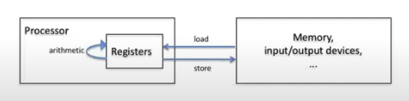
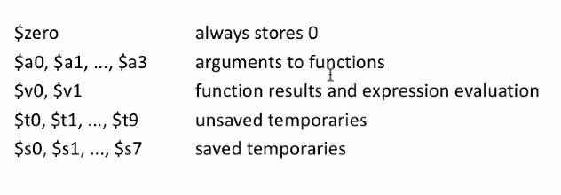

# short notes 1 jan 2021   
## introduction to the class   

- system issues common to prgramming   
    - parallelism   
    - memory system   
    - security   
    
- low-level programming   
    - C and assembly language   
        - computer converts to assembly and actually
 runs that.   

### assembly instructions   
_basics of assembly instructions:_   
   
   
_registers:_   
    
   
