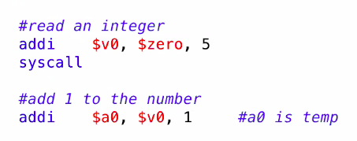

# short notes 6 jan 2021   
## assembly basics, reading and printing   
  
    
_put in $v0, coming from $zero nothing, add 5_   
_system call writes new value into $v0_   
_add value in $v0 to 1,put in $a0_   
   
note: you're allowed to reuse registers:   
`addi $a0, $a0, 1`   
this takes the value in the second $a0,   
adds 1 to it,    
then puts it back in the first $a0   

