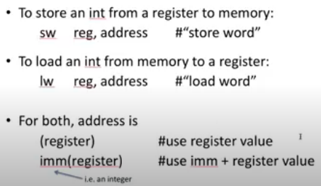

# short notes 8 jan 2021   
## Assembly in Memory   
    
#### what is memory?   
in short, a huge array of 8bit numbers   
most things aren't actually 8... ints are 4   
different kinds of data are different sizes
 by they're all multiples of the array cell
 size   
   
these are the instructions that actually going to memory:   
   
   
sw -- store word, word means 4 bytes   
this is storing from a register into an address  
lw -- load word is actually going to memory and getting some data to bring back to an address   

   
