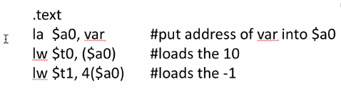
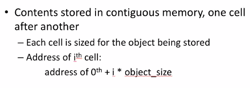
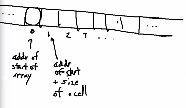
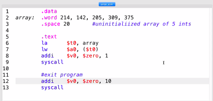

# short notes 11 jan 2021   
## examples on assembly   
   
#### reserving memory inside a program   
    
    
everything in the text segment won't
 affect the memory in the data segment
 and vice versa.    
    
if you're going to do a load or store,
 your memory address has to be aligned
 with what you're storing.    
    
ex. if you're storing 2, then you have to
 use .align 2 as 2 is a multiple of 2^2    
then, you need to reserve 4 bytes of space
 using `.space 4`    
 
`var` and `var2` are symbolic names that
 belong to that chunk of memory   
   
`var` stores and initializes   
`var2` just creates space for a later var   
   
#### loading an address   
     
   
la gets you an address from a label --
 you put something in memory, but in order
 to actually do a load or store on that
 you have to get the address from memory.   
   
la is how you set that address   
you must use an la to let the register you're
 going to load from   
it is syntactically valid to lw before la,
 however, it is not a useful program because
 you must load it before you can use it   
   
*_for our purposes, la must precede lw in useful programs_*   
   
- only lw actually reads from memory   
- la becomes other instructions, it doesn't go directly to memory   
- the labels don't go to memory -- the assembler puts them in as memory addresses   
   
#### arrays in memory   
   
   
   
this is why it's constant time to access
 any cell in memory. it doesn't matter what
 cell T'm going to   
   
#### shift left
    
this basically multiplies the number by the
 power (third element) by shifting left by x
 amount of 0s.   
   
#### printing from an array   
   
   
