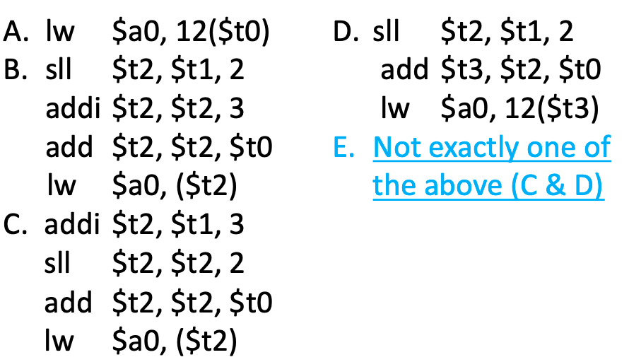

# short notes 13 jan 2021   
## strings and linked structures in assembly      
  
#### la
la -- second argument is a label   
_mars will not catch this_   
use load address as a way to get
 labels into registers   
   
rem: a label is a name for an
 address in our program   
   
#### strings
    
   
   
you have to leave room for the
 terminating null char `\0`   
   
strings use different load and
 store instructions   
`lbu` and `sb`    
we're still loading and storing,
 it's just the amount is different   
#### printing a string
   
  
#### ex incrementing
   
   
   
   
 
